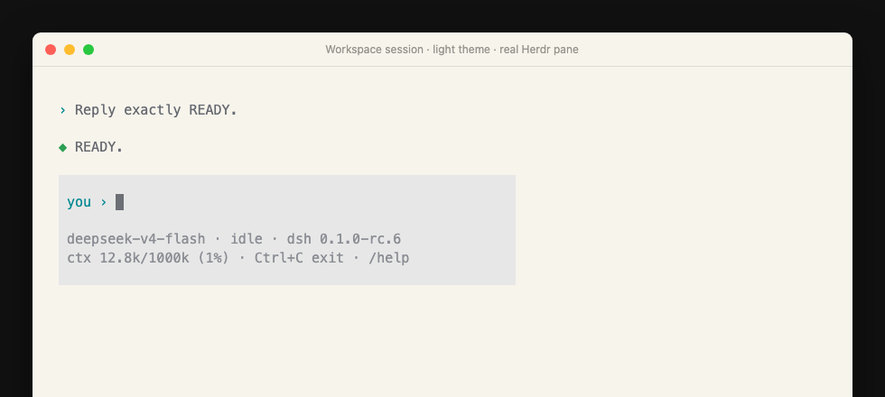
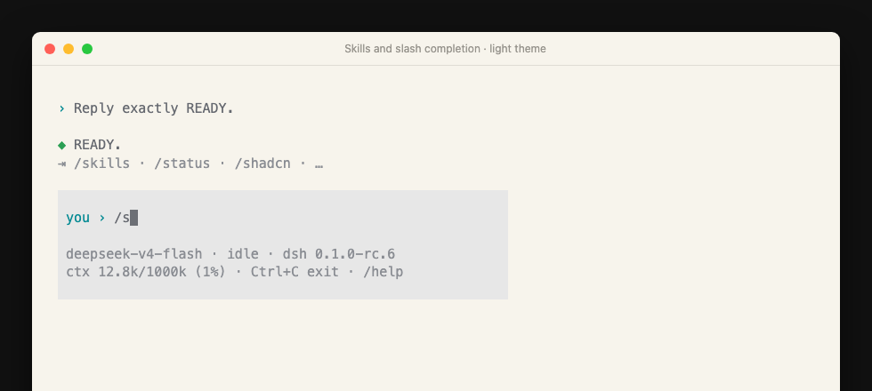
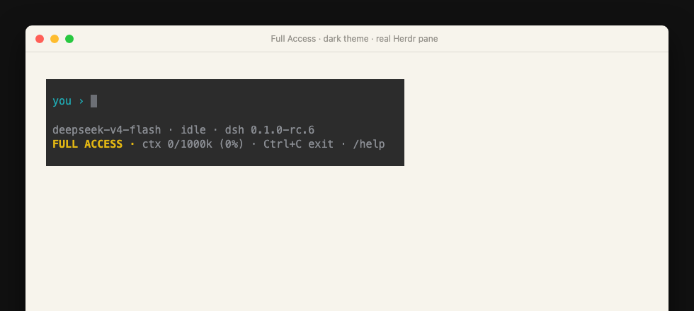

# dsh-tui

[简体中文](README.zh-CN.md) · [Changelog](CHANGELOG.md)

A small terminal UI for [DeepSeek Harness](https://github.com/deepseek-ai/deepseek-harness), built as an out-of-tree DSH profile bundle.

It is intentionally optimized for one-person daily use: start in the current directory, chat immediately, close the terminal, and continue the same workspace later.



## Quick start

Open a terminal in the project you want DeepSeek to work on:

```bash
cd /path/to/your/project
dsh-tui
```

To continue the newest session for that same project later:

```bash
cd /path/to/your/project
dsh-tui -c
```

## Install

Requirements: Node.js 22+, `pnpm`, and the official DeepSeek Harness CLI.

```bash
npm install -g @deepseek-ai/dsh
npm install -g github:orriduck/dsh-tui
```

Then enter any project and run:

```bash
cd /path/to/your/project
dsh-tui
```

The first launch creates the local `tui` profile and registers this bundle automatically. DSH remains responsible for credentials, model settings, sessions, tools, sandboxing, and approvals.

## Daily use

```bash
dsh-tui                         # new session in the current directory
dsh-tui -c                      # continue the newest session for this directory
dsh-tui "fix the failing test"  # start with a prompt
dsh-tui -r <session-id>         # resume an exact session
```

Inside the UI:

- Enter sends a follow-up; while the agent is running, it steers the current turn.
- `Ctrl+C` cancels a running turn. When idle, it saves and exits.
- `/status`, `/permission`, `/skills`, `/cancel`, `/help`, `/quit`, and `/exit` are available.
- Tool calls, reasoning, approvals, and `ask_user_question` prompts render in the terminal.
- A continuous neutral composer surface keeps input and its compact two-line status together, with a blank row of breathing room between them. Its background follows the resolved light/dark theme; the status shows model state, installed DSH version, and accumulated context usage without repeating the default workspace sandbox. Non-default permission states remain visible, with Full Access emphasized. `/permission` switches this session through DSH's official command — idle only, with a typed `FULL ACCESS` confirmation for full access.
- `/skills` lists user-invocable skills. Type `/skill-name` to load one directly; slash commands and catalog skills offer Tab completion.

## Interface states

Slash completion combines built-in commands with the current DSH skill catalog:



Full access is deliberately conspicuous after its typed confirmation:



## Herdr integration

When `dsh-tui` runs inside [Herdr](https://herdr.dev), it connects automatically. No separate hook installation is needed.

The bridge reports:

- `working`, `blocked`, and `idle`/`done` lifecycle state
- the current DSH session identity
- the generated session title and `DeepSeek` display label
- clean release when the TUI exits

This makes the DeepSeek tab visible to `herdr agent list`, `get`, and `wait`, including notifications when a background turn finishes or needs an answer. It is inert outside a Herdr-managed pane and never changes DSH credentials or permissions.

Herdr 0.8.0 does not yet include a native `dsh` agent kind, so `herdr agent start --kind dsh` and `herdr agent prompt` are not available yet. Start and type into the TUI normally; native launch/control belongs in a future Herdr integration.

## Appearance

The first launch creates `~/.dsh/tui.json`:

```json
{
  "theme": "system"
}
```

`system` follows the terminal background automatically. It uses a short terminal color probe first, then `COLORFGBG`, then the macOS appearance setting when needed. Set `theme` to `light` or `dark` to pin it instead.

For a one-off override:

```bash
DSH_TUI_THEME=dark dsh-tui
```

Run `/status` inside the TUI to see the resolved theme and where it came from.

## DSH version and updates

The status bar reads the installed Harness version from `dsh --version`. After startup, a non-blocking check against the official npm registry looks for a newer `@deepseek-ai/dsh` release. If one exists, the status bar shows the exact command to install it, for example:

```bash
npm install -g @deepseek-ai/dsh@0.1.0-rc.7
```

The check times out quickly and silently disappears when offline, so it never blocks the TUI. Set `DSH_TUI_UPDATE_CHECK=0` to disable the registry request. DeepSeek Harness is still a developer preview; review the [changelog](CHANGELOG.md) and compatibility notes before upgrading across preview releases.

## Credentials and permissions

This package never reads or stores a DeepSeek key itself. It uses the normal DSH credential chain, including `~/.dsh/.credentials.yaml` and supported environment variables.

The default DSH permission preset is `workspace-write` with interactive approval. The TUI answers DSH's official `approval/request` and user-question seams; it does not bypass the sandbox. The current preset remains visible in the composer status, while `/status` provides the underlying sandbox/approval facts. `/permission` (bare or with a preset name) switches through the official command — switches are idle-only, affect only the current session, and full access requires typing `FULL ACCESS` to confirm.

## Scope

Included:

- streaming text and reasoning
- tool activity and results
- interactive approvals and questions
- a persistent permission badge with `/permission` switching (idle-only, full-access confirmation)
- context-window usage and token totals
- installed DSH version and an optional npm update hint
- skill discovery, direct invocation visibility, and Tab completion
- durable sessions and current-directory continuation
- one-command profile bootstrap
- automatic Herdr lifecycle reporting when available

Not included yet: split panes, remote persistence, a graphical session browser, image attachments, native Herdr launch/control, or Web-client parity. Herdr/tmux can own terminal persistence around this TUI if needed.

## Development

```bash
pnpm install --registry=https://registry.npmjs.org
pnpm check
pnpm test
pnpm build

# Use the checkout directly while developing
dsh plugin --profile tui add link:.
dsh --profile tui
```

The official Harness is currently a developer preview. DeepSeek package versions are pinned to `0.1.0-rc.6` so an upstream breaking change is visible instead of silently changing behavior.

Release history is maintained in [CHANGELOG.md](CHANGELOG.md). `package.json` remains the machine-readable source of the current dsh-tui version.

## License

MIT
